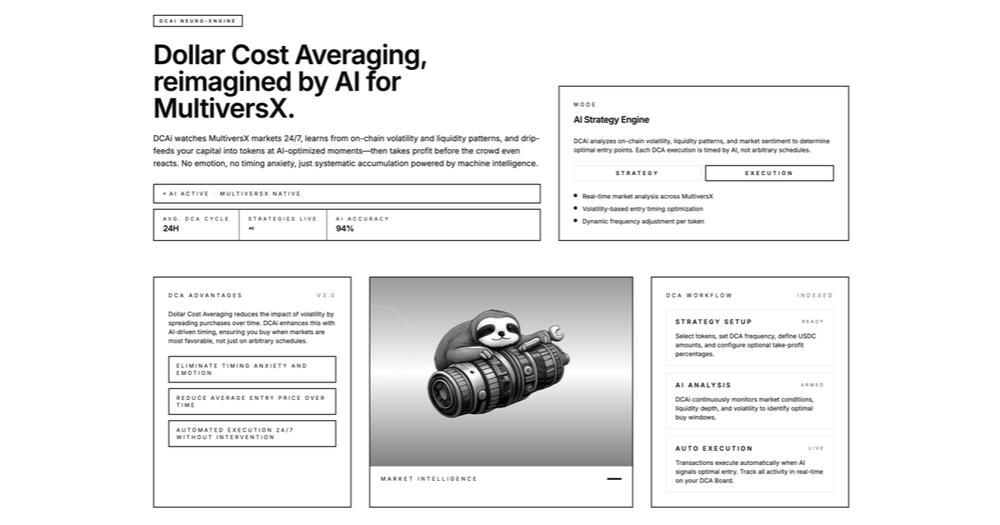

# DCAi: AI-Powered Dollar Cost Averaging on MultiversX

<div align="center">
  
</div>

<br />

<div align="center">
  <a href="https://dcai-virid.vercel.app/"><strong>Launch App</strong></a> ·
  <a href="#features"><strong>Features</strong></a> ·
  <a href="#how-it-works"><strong>How It Works</strong></a> ·
  <a href="#tech-stack"><strong>Tech Stack</strong></a>
</div>

<br />

**DCAi** is a next-generation decentralized application (dApp) built on the **MultiversX** blockchain. It revolutionizes traditional Dollar Cost Averaging (DCA) by integrating AI-driven execution logic. Instead of buying at arbitrary time intervals, DCAi analyzes market volatility and liquidity to execute swaps at optimal moments, maximizing your entry efficiency while automating your exit strategy.

---

## 🚀 Features

### 💰 Automated Take-Profit (The Game Changer)
**Why sell too early or hold too long?** DCAi removes the emotion from exiting.
-   **Set & Forget**: Define your target profit percentage (e.g., +30%, +100%).
-   **Smart Monitoring**: The contract continuously tracks the value of your accumulated tokens against your average buy price.
-   **Auto-Execution**: The moment your target is hit, the Smart Contract **automatically swaps** your position back to USDC. No manual intervention required. Secure your gains while you sleep.

### 🧠 Neuro-Engine Execution
Unlike standard DCAs that buy blindly, our AI-driven engine monitors on-chain metrics 24/7. It executes your scheduled buys during favorable market conditions to optimize your average entry price, ensuring you get more tokens for your money.

### 🛡️ Non-Custodial & Secure
You stay in control. Funds are deposited into specific Smart Contracts where **only you** have the authority to manage or withdraw them. There are no middlemen, just code.

### ⚡ MultiversX Efficiency
Built on one of the fastest and most scalable blockchains, ensuring your transactions are lightning-fast and cost mere fractions of a cent.

---

## 🏗️ Smart Contract Architecture

DCAi employs a sophisticated **Parent-Child Contract** design pattern to ensure maximum security and scalability:

### 1. The Parent Contract (Factory)
-   **Role**: Acts as the central registry and factory.
-   **Function**: Deploys a unique, isolated "Child" contract for every new strategy created.
-   **Benefit**: Ensures organized management of all active strategies on the platform.

### 2. Child Contracts (Strategies)
-   **Role**: The individual "Vault" for your specific DCA strategy.
-   **Isolation**: Each strategy has its own dedicated Smart Contract address.
-   **Security**: Your funds (USDC and purchased tokens) are held here. Because it's an isolated contract, your assets are never commingled with other users' funds.
-   **Logic**: Contains the specific rules for your strategy (Frequency, Amount, Token, Take-Profit Target).

---

## 🛠️ How It Works

1.  **Connect Wallet**: Login securely with xPortal, Ledger, or Web Wallet.
2.  **Select Strategy**: Choose your target token (e.g., EGLD, MEX, HTM).
3.  **Configure**: Set your investment amount, frequency (Daily/Weekly/Monthly), and Take-Profit target.
4.  **Deposit**: Sign the transaction to fund your strategy with USDC.
5.  **Relax**: The AI monitor takes over, executing trades and managing your position automatically.

---

## 💻 Tech Stack

This project is built with a modern, high-performance stack:

-   **Frontend**: [Next.js](https://nextjs.org/) (React Framework)
-   **Styling**: [Tailwind CSS](https://tailwindcss.com/) & Vanilla CSS for custom animations.
-   **Blockchain Interaction**: [MultiversX SDK](https://docs.multiversx.com/sdk-and-tools/sdk-js/).
-   **3D Visuals**: [Three.js](https://threejs.org/) for immersive background elements.
-   **State Management**: React Hooks & Context API.

---

## 🏁 Getting Started

Clone the repository and run the development server locally:

```bash
# Clone the repository
git clone https://github.com/klepi21/dcai.git

# Navigate to the project directory
cd dcai

# Install dependencies
npm install

# Run the development server
npm run dev
```

Open [http://localhost:3000](http://localhost:3000) with your browser to see the application.

---

## 📜 License

Distributed under the MIT License. See `LICENSE` for more information.

<br />

<div align="center">
  <sub>Built with ❤️ for the MultiversX Ecosystem</sub>
</div>
